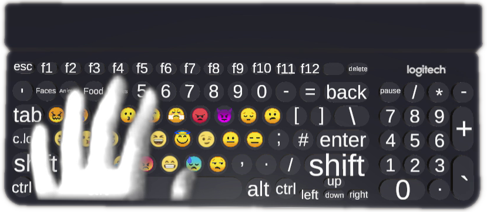
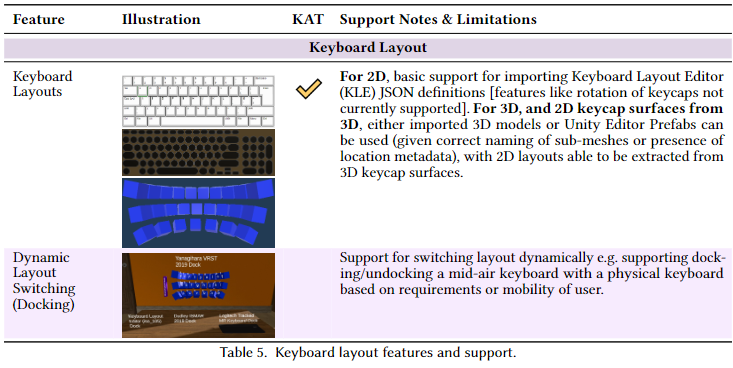
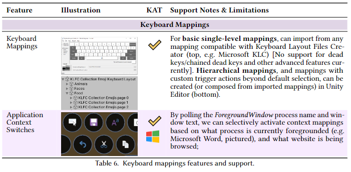
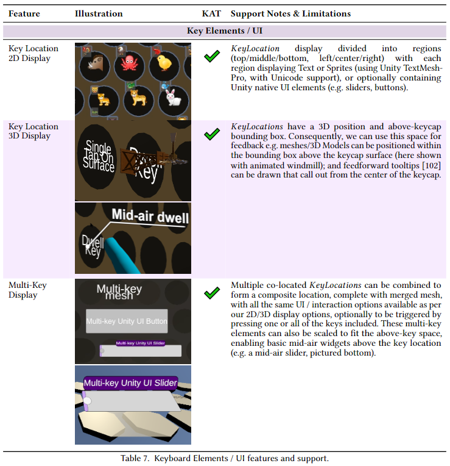
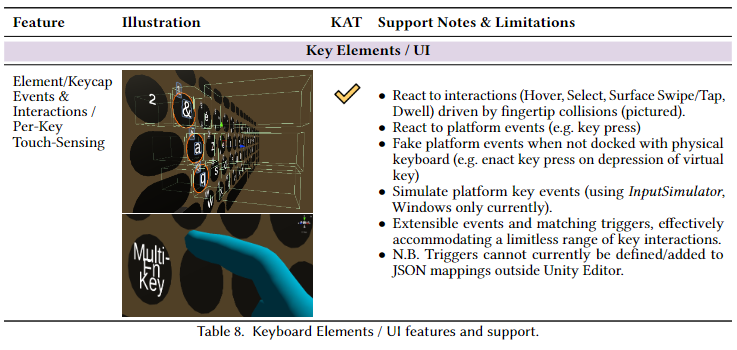

# Keyboard Augmentation Toolkit (KAT)

## Abstract from paper
This paper discusses the **Keyboard Augmentation Toolkit** (KAT) which supports the creation of virtual keyboards that can be used both for standalone input (e.g. for mid-air text entry) and to augment physically tracked keyboards/surfaces in mixed reality. In a user study, we firstly examine the impact and pitfalls of visualising shortcuts on a tracked physical keyboard, exploring the utility of virtual per-keycap displays. Supported by this and other recent developments in XR keyboard research, we then describe the design, development and evaluation-by-demonstration of KAT. KAT simplifies the creation of virtual keyboards (optionally bound to a tracked physical keyboard) that support **enhanced display** - 2D/3D per-key content that conforms to the virtual key bounds; **enhanced interactivity** - supporting extensible per-key states such as tap, dwell, touch, swipe; **flexible keyboard mappings** that can encapsulate groups of interaction and display elements e.g. enabling application-dependent interactions; and **flexible layouts** - allowing the virtual keyboard to merge with and augment a physical keyboard, or switch to an alternate layout (e.g. mid-air) based on need. Through these features, KAT will assist researchers in the prototyping, creation and replication of XR keyboard experiences, fundamentally altering the keyboard's form and function.

[ACM DL Link](https://dl.acm.org/doi/abs/10.1145/3490495) - Paper can also be found [in the repository here](Paper/author_copy.pdf)

[Video Link](https://youtu.be/F3O3bRfmoUM)

Reference: Mark McGill, Stephen Brewster, Daniel Pires De Sa Medeiros, Sidney Bovet, Mario Gutierrez, and Aidan Kehoe. 2022. Creating and Augmenting Keyboards for Extended Reality with the Keyboard Augmentation Toolkit. _ACM Trans. Comput.-Hum. Interact._ 29, 2, Article 15 (April 2022), 39 pages. https://doi.org/10.1145/3490495

## Introduction
KAT is a toolkit for creating augmented keyboard interactions. The motivation behind KAT is the adoption of XR for productivity, and our need for keyboard-type inputs, enacted both via tracked physical keyboards, as well as through mid-air virtual keyboards. Our belief is that the boundary between the two will blur, and that we can support tracked physical keyboards and mid-air keyboards that have parity in the interactions they support - supporting better productivity and expressivity. KAT targets the following features in particular:

* **Extensible Key Interactions** From capacitive sensing, to raycast controllers, to hand tracking, the space
on/around a (physical or virtual) key is now able to be appropriated for interaction in a variety of ways,
with research continually exploring novel sensing and input modalities. Consequently, the events that
could emanate from a key (or collection of keys) need to be extensible, enabling practitioners to define new
interactions that can be replicated and shared.
* **Key Event Interception**, Suppression, Simulation Where possible, support the interception, suppression
and simulation of key events, allowing practitioners to re-write existing physical keyboard functionality
based on proposed mappings and simulate physical keyboard outputs with virtual keyboards.
* **2/3D and Multi-Key Displays** - The space on/above/around a keycap could be appropriated for interaction and
display, and this space may vary based on the keyboard layout and the current dimensions of a given key,
or indeed span multiple keys.
* **Hierarchical Keyboard Mappings** - Applications could expose multiple keyboard mappings depending on their
current focus, whilst users might have their own preferences (e.g. binding shortcuts to the number pad).
Consequently, we need to be able to support the definition and usage of different keyboard mappings,
inheritance in keyboard mappings, and different behaviours in conflict management where multiple
mappings attempt to utilize the same key location.
* **Changeable Keyboard Layouts** - We need to be able to support the import or definition of 2/3D virtual layouts
such that novel layouts are shareable. The virtual keyboard layout might vary over time, adapting to
mobility (e.g. mid-air input), context (e.g. sitting down at desk, aligning to existing surfaces), or available
input modalities (e.g. adapting to an existing physical keyboard to create an augmented keyboard). Where
possible, interactions and per/multi-key display elements should be able to handle this plasticity in keyboard
layout.
But please do see the paper for details here!

## Key Features
* **Dynamic Keyboard Layouts** This includes generating virtual layouts based on *existing 3D models and Unity prefabs*, as well as from [Keyboard Layout Editor](http://www.keyboard-layout-editor.com/) definitions (after conversion using [kle-serial](https://www.npmjs.com/package/@ijprest/kle-serial) [n.b. we only have basic support for KLE definitions currently]. Layouts can be changed dynamically, and we provide examples where the virtual keyboard can for example "dock" with a tracked physical keyboard, conforming the UI to the physical keys, supporting transitions from mid-air to physical keyboard usage.

* **Dynamic Keyboard Mappings** Mappings can be built manually, or their generation can be scripted (recommended), and we provide examples for doing just that. Mappings can also be imported from [Keyboard Layout Files Creator](https://github.com/39aldo39/klfc) (use the JSON export option) - as with KLE, support is basic and doesn't cover all KLFC features and edge cases, as can be seen in some of the language examples (e.g. German and Russian key layouts).

* **Extensible Variety of Single and Multi-Key Interactions** Keys (and combinations of keys) can have different display elements attached to them, different interactions facilitated around them (e.g. based on proximity, collisions, key actions), and different output actions (e.g. suppressing and overwriting key event output - which even works with native windows apps that support Unicode text entry).

## Requirements
* Typical Unity project, currently targeting Unity 2019 (2019.4.13f1), so mileage may vary with other distributions. 
* For physical keyboards, currently our key hook interception/suppression is Windows only

## Getting Started
* See the `Assets\KAT\Examples` folder for example scenes showing how to use different layouts and mappings, as well as a variety of examples for generating or defining layouts and mappings.

## Limitations and Todos
* We don't have a working example using the **Oculus Tracked Keyboard SDK** yet - our intention is to get KAT working with this shortly over the summer. It shouldn't be hard though - the key thing is being able to know which key mesh maps to which key, and there are examples of how to do this for generic 3D models in KAT. So if anyone wants to give it a go before we get a chance, ping us!
* The event model currently used for comms between components (key elements, triggers, UI elements etc.) is a pub-sub approach that is a bit convoluted and not very performant - fine for prototyping interactions, but needs simplifying and re-architecting for systems that are intended to be published. We have some refinements we plan to do on this shortly (e.g. further simplifying how events are published, better typing of events to allow subscribers to subscribe to general categories) - do get in contact if you want to contribute some refactoring here!
* Bugs! Bugs everywhere! This is a piece of software intended to support prototyping and development of novel keyboard interactions, but it is far from robust or well documented currently. We intend to make improvements here, and would welcome any contributors that want to help take this forward. 
* We're a bit behind on some of the core Unity libraries (e.g. using an older version of the XR interaction toolkit) - again, we'll be updating and checking compatibility shortly, so mileage may vary here.

## Tips / Pointers
### How to generate sprite maps for keyboard mappings
If you want to generate sprites that can be rendered by TextMeshPro, here's an example of how the emoji sprites were built:
1) Grab https://github.com/iamcal/emoji-data 
2) Select which emojiis you want to use, and dump them in a folder
3) Use https://www.codeandweb.com/texturepacker and pack the sprites into an atlas (JSON Array) - all defaults
4) Use TextMeshPro to create a library from that atlas (Window -> TextMeshPro -> Sprite Importer )
N.B. if the sprites are mis-aligned, chances are Unity is compressing the texture and messing up the UV coordinates. Disable power of two/compression on the texture then generate the library.
N.B.2. Set the imported .png to be a sprite!
5) For the given TextMeshPro element, point it to the library or add it as fallback on EmojiCore (default used on all TextMeshPro elements)
6) If it's a unicode character named as per the emoji-data file names, use the surrogate pair to create the character e.g. "\uD83D\uDE00" or the 5-digit hexcode e.g. "1f507" (which is converted to a surrogate pair). Or use the sprite file name directly e.g. <sprite="office" name="Copy"> where office is the library and Copy is the sprite name
7) Put the sprite pack in the Resources/Sprite Assets folder (textmeshpro uses this by default) and it should be picked up in every textmesh
8) Select the EmojiOne sprite atlas and add the new pack as a fallback sprite asset (step 7 might actually be pointless!)

## Licensing and additional assets
Our contributions fall under MIT licensing, and are intended for free unrestricted academic and research use. There are third party components and dependencies used in this project with different licensing terms. Notable assets that helped here (that will have different licensing restrictions) are:
* https://github.com/dbrizov/NaughtyAttributes
* https://github.com/upta/pubsub
* https://github.com/Ranguna/Triangle-NET-Unity-Port
* https://github.com/michaelnoonan/inputsimulator
* 3D models from Logitech's prior VR keyboard projects
* ExtendedScriptableObjectDrawer - https://gist.github.com/tomkail/ba4136e6aa990f4dc94e0d39ec6a058c
